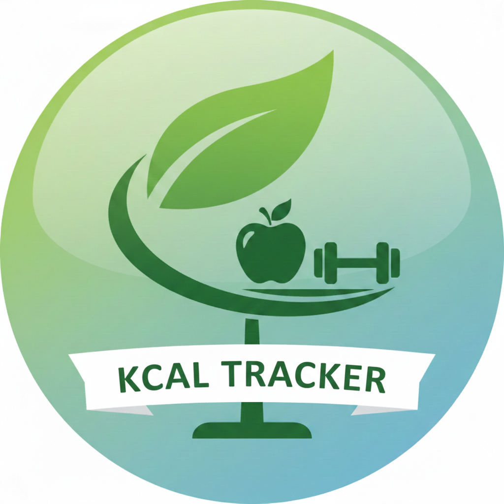

<p align="center">
  
</p>

<h1 align="center">KcalTrack</h1>

<p align="center">
  Offline-first Kalorienzähler für Android — kein Backend, keine Registrierung.
</p>

---

## Features

- **Dashboard** mit Tagesbilanz (TDEE, Aufnahme, Restkilokalorien)
- **Essen-Tracking** mit Templates und Kategorien
- **Aktivitäts-Tracking** mit Templates und Kategorien
- **Gewichtsverlauf** mit Diagramm
- **Homescreen-Widget** mit Quick-Add
- **Material You** / Dynamic Colors
- **Swipe-Navigation** zwischen Tabs
- Vollständig offline — kein Backend, keine Registrierung

## Screenshots

*Folgt.*

## Tech Stack

| Komponente | Technologie |
|-----------|-------------|
| Sprache | Kotlin 2.0.21 |
| UI | Jetpack Compose + Material 3 (Dynamic Colors) |
| Architektur | Single Activity, MVVM |
| Datenbank | Room (KSP) |
| Navigation | Jetpack Navigation Compose |
| Widget | Glance (Jetpack) |
| Async | Kotlin Coroutines + Flow |
| DI | Manuelle Dependency Injection |
| Min SDK | 29 (Android 10) |
| Target SDK | 36 |
| Build | AGP 9.0.1, Version Catalog (`libs.versions.toml`) |

## Architektur

MVVM mit Repository-Pattern und manueller Dependency Injection:

```
Screen (Composable) → ViewModel → Repository → DAO → Room DB
```

- Screens beobachten UI-State via `StateFlow`
- ViewModels halten keinen Compose-State, nur `StateFlow`/`SharedFlow`
- Repositories abstrahieren den Datenzugriff
- DAOs definieren SQL-Queries und geben `Flow<T>` zurück

## Projektstruktur

```
de.leipsfur.kcal_track/
├── data/
│   ├── db/              # Room Database, Entities, DAOs
│   └── repository/      # Repository-Implementierungen
├── domain/
│   └── model/           # Domain-Modelle
├── ui/
│   ├── dashboard/       # Dashboard-Screen + ViewModel
│   ├── food/            # Essen-Tracking Screen + ViewModel
│   ├── activity/        # Aktivitäts-Tracking Screen + ViewModel
│   ├── weight/          # Gewichts-Tracking Screen + ViewModel
│   ├── settings/        # Einstellungen Screen + ViewModel
│   ├── navigation/      # NavHost, Bottom Navigation
│   └── theme/           # Material You Theme, Colors
├── widget/              # Glance Widget + Quick-Add Overlay
└── KcalTrackApplication.kt
```

## Build & Entwicklung

### Voraussetzungen

- Android Studio (aktuelle stabile Version)
- JDK 25+
- Android SDK (Min SDK 29, Target SDK 36)

### Build-Befehle

```bash
./gradlew assembleDebug          # Debug-APK bauen
./gradlew :app:installDebug      # Debug-Build auf Gerät installieren
./gradlew lint                   # Android Lint ausführen
```

### WSL-Setup

Falls in WSL entwickelt wird, müssen die Umgebungsvariablen gesetzt werden:

```bash
export JAVA_HOME=/usr/lib/jvm/java-25
export ANDROID_HOME=/mnt/c/Users/<user>/AppData/Local/Android/Sdk
export PATH=$JAVA_HOME/bin:$PATH
```

Falls Android SDK-Tooling in WSL weiterhin Probleme macht: Builds aus Android Studio oder PowerShell starten.

## Tests

```bash
./gradlew test                       # JVM Unit-Tests
./gradlew connectedAndroidTest       # Instrumentierte Tests (Gerät/Emulator)
```

- **Unit-Tests** (`app/src/test/`): ViewModels, Repositories, Business-Logik
- **Instrumentierte Tests** (`app/src/androidTest/`): Room-DAOs, UI-Tests
- Frameworks: JUnit4, MockK, `kotlinx-coroutines-test`, AndroidX Test, Espresso

## Dokumentation

| Thema | Pfad |
|-------|------|
| User Stories | [`docs/stories/`](docs/stories/) |
| Architektur (arc42) | [`docs/arch/`](docs/arch/) |
| Implementierungs-Todos | [`docs/todo/`](docs/todo/) |
| Projektrichtlinien | [`CLAUDE.md`](CLAUDE.md) |
| Repository Guidelines | [`AGENTS.md`](AGENTS.md) |

## Lizenz

*Noch keine Lizenz festgelegt.*
